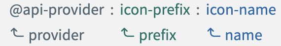

# VvIcon

VvIcon use [Iconify](https://iconify.design/) library and [Iconify Vue Component](https://docs.iconify.design/icon-components/vue/) under the hood.

## Props

`VvIcon` provide `name`, `provider` and `prefix` props. 
Only `name` is required because the default provider is `vv` and the default `prefix` is `normal`.

## Custom icons

`@volverjs/ui-vue` has the node bin script `generate-icons` to create the [IconifyJSON](https://docs.iconify.design/types/iconify-json.html) objects.
This function for input params has the source path to the icons folder and the destination path for output json files.

```bash
generate-icons --srcPath=assets/icons  --destPath=src/assets/icons
```

The source path can have subfolders. In this case the folder name will be the iconify [prefix](https://docs.iconify.design/icon-components/vue/#icon) and all the children SVG icons will be the icons `name`.
The `api-provider` is `@vv` by default, you can change it in plugin options.



Ex: If my SVG icons folder root is structured like:

```
assets/icons/simple/*.svg
assets/icons/normal/*.svg
assets/icons/detailed/*.svg
```

The script `generate-icons --srcPath=assets/icons` will generate icons like `@vv:simple:{fileName}`, `@vv:normal:{fileName}` and `@vv:detailed:{fileName}`.


### Example

Put the SVG files inside a folder (ex. `assets/icons/custom/*.svg`).
Launch the script `generate-icons --srcPath=assets/icons/custom` to generate the `custom.json` file. Import the `custom.json` file in your `main.ts` file and add it to the `iconsCollections` array.

```typescript
import customIcons from '@/assets/icons/custom.json'

app.use(VolverPlugin, {
	iconsCollections: [customIcons]
})
```
Now you can use the icons in your templates with the `prefix` prop.

```html
<vv-icon name="iconName" prefix="custom" />
```

Or using the `@vv:custom:{iconName}` syntax.

```html
<vv-icon name="custom:{iconName}" />
```
