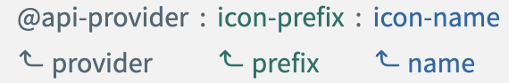

# VvIcon

VvIcon use [Iconify](https://iconify.design/) library and [Iconify Vue Component](https://docs.iconify.design/icon-components/vue/) under the hood.

## SSR support

The `svg` and `src` props parse SVG strings using the DOM API (`DOMParser`). In a browser environment this is available natively. In a **Node.js / SSR** environment (Nuxt, Vite SSR, etc.) there is no native DOM, so `jsdom` is used as a polyfill.

`jsdom` is an **optional** peer dependency — it is not installed automatically. If you use `svg` or `src` props server-side, install it manually:

```bash
npm install jsdom
# or
pnpm add jsdom
# or
yarn add jsdom
```

Without `jsdom`, the `svg`/`src` props are silently ignored during SSR and the icon will be rendered once the page is hydrated on the client.

## Props

`VvIcon` provide `name`, `provider` and `prefix` props.
Only `name` is required because the default provider is `vv` and the default `prefix` is `normal`.

## Custom icons

`@volverjs/ui-vue` has the node bin script `generate-icons` to create the [IconifyJSON](https://docs.iconify.design/types/iconify-json.html) objects.
This function for input params has the source path to the icons folder and the destination path for output json files.

```bash
generate-icons --srcPath=assets/icons  --destPath=src/assets/icons
```

The source path can have subfolders. In this case the folder name will be the iconify [prefix](https://docs.iconify.design/icon-components/vue/#icon) and all the children SVG icons will be the icons `name`.
The `api-provider` is `@vv` by default, you can change it in plugin options.



For example, if you have the following folders:

```
assets/icons/simple/*.svg
assets/icons/normal/*.svg
assets/icons/detailed/*.svg
```

The script `generate-icons --srcPath=assets/icons` will generate three json files: `simple.json`, `normal.json` and `detailed.json`.
Each file contains the icons with the `@vv` provider and the prefix `simple`, `normal` and `detailed` respectively.

```
@vv:simple:{fileName}
@vv:normal:{fileName}
@vv:detailed:{fileName}
```

By default, the script will replace the icon colors (for fill and stroke) with the `currentColor` value. If you want to keep the original colors, you can use the `--keepColors` flag.

```bash
generate-icons --srcPath=assets/icons --destPath=src/assets/icons --keepColors
```

If you want to automatically watch the source folder and regenerate the json files when a change is detected, you can use the `--watch` flag.

```bash
generate-icons --srcPath=assets/icons --destPath=src/assets/icons --watch
```

### Example

Put the SVG files inside a folder (ex. `assets/icons/custom/*.svg`).
Launch the script `generate-icons --srcPath=assets/icons/custom` to generate the `custom.json` file. Import the `custom.json` file in your `main.ts` file and add it to the `iconsCollections` array.

```typescript
import customIcons from '@/assets/icons/custom.json'

app.use(VolverPlugin, {
    iconsCollections: [customIcons]
})
```

Now you can use the icons in your templates with the `prefix` prop.

```html
<vv-icon name="iconName" prefix="custom" />
```

Or using the `@vv:custom:{iconName}` syntax.

```html
<vv-icon name="custom:{iconName}" />
```
